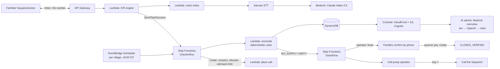

# JalSakshi · जल साक्षी

**Water witness. Households confirm whether tap water actually came, and repairs count only when they confirm it's back.**

> Built for **Environmental Hacks** (WeMakeDevs × AWS Builder Center, Bharat Builds Tour), **Heat & Water** track.
> Live console: **https://jalsakshi.humanslop.in** (Panchayat login) · How it works on AWS, no login: **https://jalsakshi.humanslop.in/how** · Demo video: _coming soon_

---

## The problem

India's Jal Jeevan Mission has put a tap connection in most rural homes. Whether **water comes out of that tap** is a different question.

- On 30 Sep 2026, Chhattisgarh's Jal Jeevan Mission (JJM) Mission Director told every Collector to hand completed water schemes over to Gram Panchayats ("Jal Arpan") at the special Gram Sabhas from **2 Oct 2026**.
- The official progress report (JJM IMIS, data as on 07/10/2026) shows **7,603 Chhattisgarh villages reported "Har Ghar Jal" (tap water in every home) but only 6,594 certified**. About 1,009 villages are waiting on a Gram Sabha decision.
- A CAG audit tabled in July 2026 found villages certified **despite incomplete works**. In Korba, ₹516 crore has been paid and about 110 villages get water.
- The official review, *Jal Seva Aankalan*, is a once-a-cycle self-assessment by the village water committee. **Nobody asks each household whether water came today.**

The people who know are the women who wait at the tap, usually on a shared keypad phone, in Hindi or Chhattisgarhi.

## What JalSakshi does

1. **Registers families by phone, with consent.** The Panchayat secretary pastes numbers, photographs the register (Bedrock reads names, mobiles and areas, and the secretary checks every row), or families simply give a missed call. The first call reads a short notice in the family's language (Hindi or Chhattisgarhi today) and asks them to press 1 to agree. Every consent is kept in an append-only record.
2. **Asks every evening.** A short call on any keypad phone: *Did water come today from your tap / standpost / handpump / borewell / tanker? For how many hours? Was it clean?* It works for any drinking-water source, not only Jal Jeevan Mission taps.
3. **Decides, deterministically.** Tested rules (no AI) turn the answers into each water point's day status: `SUPPLIED`, `PARTIAL`, `NO_SUPPLY`, `DIRTY`, or `UNVERIFIED` when too few families answered.
4. **Takes complaints at any hour.** A missed call to the village number is rejected (free for the caller) and called straight back with a menu: no water, dirty water, or speak the complaint (Sarvam speech-to-text, then Bedrock reads it).
5. **Calls the pump operator.** The operator presses 1 for fixed, 2–5 for a reason (parts, electricity, pipe, not their source), 6 to explain in their own words, or **7 if they cannot fix it alone**. Key 7 sends the complaint to the **Sarpanch**, who gets a call with the operator's own words.
6. **Closes only when families confirm.** After "fixed", the same families are called back. The complaint closes as `CLOSED_VERIFIED` only when enough of them say water is back; otherwise it reopens.
7. **Advises, never decides.** Each complaint page has an AI overview and a suggested next step (call the operator again, send it to the Sarpanch, raise it with the PHED block office, or wait). The suggestion comes from a decision model chain: Jev, then OpenAI Decisions, then fixed rules. Only de-identified codes and counts are sent to those models. A person presses the button.
8. **Gives evidence.** Analytics per water point, a weekly summary call to the Sarpanch, a public residents' page, and a Gram Sabha evidence sheet, with every number sourced.

**Who it serves:** the family that needs water, and the Sarpanch, Panchayat Secretary and pump operator who must act. The JalSakshi team sets up each Panchayat's login and call languages.
**What changes:** a broken pump is fixed and *proven* fixed by the families who use it, and the Gram Sabha decides on certification with evidence from its own households.

## Architecture



| Layer | AWS |
|---|---|
| Orchestration | Step Functions (Map, `waitForTaskToken`, Retry/Catch), EventBridge Scheduler (daily calls, delayed jobs) |
| Compute | Lambda (Python 3.12, Powertools; 18 functions), API Gateway HTTP API |
| Data | DynamoDB (single table, PITR, TTL), S3 (prompt audio, voice-note archive, data-source cache) |
| AI | Amazon Bedrock: Claude Haiku 5.5 → Claude Haiku 4.5 → Nova 2 Lite, then a template (voice notes, names and areas, register photos, complaint overviews); Strands Agents |
| Policy | **Cedar**: consent, no calls after a refusal, call-back limit, quorum before close, Sarpanch-approved announcements, department privacy |
| Web | CloudFront + S3, Cognito (team-created Panchayat logins) |
| Ops | CloudWatch dashboard and alarms, SSM Parameter Store for keys, AWS CDK (Python), region `ap-south-1` (Mumbai) |

Outside AWS: Vobiz (Indian phone number), Sarvam (Bulbul voice "Ritu", speech-to-text), and the decision models Jev and OpenAI Decisions (de-identified facts only). Details are in [docs/ARCHITECTURE.md](docs/ARCHITECTURE.md).

## What it costs (estimate)

AWS usage for one village of **50 families**, one evening call each, a few complaints a month. These are estimates from AWS list prices in Oct 2026, not a bill.

| Item | Assumption | Per village per month |
|---|---|---|
| Step Functions (standard) | ~310 state transitions per evening run, $0.025 per 1,000 | ~$0.23 |
| Lambda, API Gateway, DynamoDB, S3 | ~9,000 small invocations and writes | under $0.05 |
| Bedrock (Haiku 5.5) | ~30 voice notes and overviews, ~2,000 tokens each, $0.10 / $0.50 per M tokens in/out | under $0.05 |
| Decision models | Jev $0.042, OpenAI $0.10 per M input tokens, ~300 tokens a suggestion | under $0.01 |
| **AWS + AI total** | | **about $0.35** |

Fixed per deployment: the phone number (₹500 a month) and the CloudWatch dashboard and alarms (a few dollars). Telephony minutes are the main running cost and depend on the Vobiz plan. Prompt audio is rendered once with Sarvam and cached; speech-to-text runs only for spoken notes.

## Data sources and freshness

| Source | Used for | Freshness |
|---|---|---|
| JJM IMIS Har Ghar Jal report | claimed and certified status | state self-reported, "as on" date shown |
| India-WRIS / CGWB 2025 | groundwater stage of the block | annual assessment |
| Open-Meteo | recent rain (context) | model, not gauge |
| Household check-ins | observed supply | live |

## Honest limits

- **Pilot scale.** The pilot village is Kutelabhatha (Durg, Chhattisgarh): a handful of real families, who agreed on the phone, plus the team's own phones for testing. The labelled "Sample village" in the console holds generated history, and it is the only place generated data is used.
- **PHED escalation is simulated.** There is no public API into IMIS, Meri Panchayat or PHED ticketing, so we never auto-dial government helplines; the "raise it with the block office" suggestion is for the secretary to act on.
- **Chhattisgarhi prompts are a draft** awaiting a native speaker's review. Hindi is the default.
- AI suggestions are advice only, from de-identified facts; the decision models' accuracy was checked on 8 made-up labelled cases, not field data.
- Production calling needs a service-series number and DLT registration through a Panchayat or government partner.

## Run it

Prerequisites: Python 3.12 + [uv](https://docs.astral.sh/uv/), Node 20.19+ + pnpm 9, an AWS CLI profile for an account with Bedrock access in `ap-south-1`. CDK runs through `npx aws-cdk@2`.

**Locally, no AWS needed** (tests stub every AWS and network call):

```bash
uv sync --all-groups
uv run ruff check . && uv run pytest -q
cd web && pnpm install && pnpm test && pnpm dev:mock   # console on seeded demo data, labelled simulated
```

**Your own stage** (`dev-<you>`, always `ap-south-1`):

```bash
cp .env.example .env                                  # local keys + TEST_NUMBERS (gitignored, never commit)
uv run python scripts/build_lambda.py                 # Lambda asset with Linux wheels -> build/lambda (do this first)
cd infra
npx aws-cdk@2 bootstrap aws://<account-id>/ap-south-1 # once per account
npx aws-cdk@2 deploy --all -c stage=dev-<you>         # voice_provider=simulator by default
cd ..
uv run python scripts/seed_demo.py --stage dev-<you> --allowlist --ivr-token --schedules
uv run python prompts/render.py --stage dev-<you>      # Hindi prompt audio (Sarvam Bulbul) -> S3 + CloudFront
```

Then:
- Put the vendor secrets in SSM as SecureString under `/jalsakshi/dev-<you>/`: `sarvam_api_key`, `vobiz_auth_id`, `vobiz_auth_token`, `vobiz_did`.
- Optional: `jev_api_key` and `openai_api_key` for the next-step suggestions (`scripts/put_secrets.py` copies them from `.env`). Without them the fixed rules suggest.
- Enable Bedrock model access in `ap-south-1` for Claude Haiku 5.5 (`global.` profile), Claude Haiku 4.5 (`in.` profile) and Nova 2 Lite (`global.` profile). Without them, every AI text falls back to its template.
- Console against the stage: copy `web/.env.example` to `web/.env.local`, fill it from the stack outputs (`ApiUrl`, `CognitoDomain`, `UserPoolClientId`, `WebUrl`/auth/callback), run `pnpm build`, and deploy `JalSakshi-dev-<you>-Web` again. Add users to a role group (`PANCHAYAT_SECRETARY`, `NAL_JAL_MITRA`, ...).
- Real phone calls: once the Vobiz DID is live, redeploy with `-c voice_provider=vobiz` and run `scripts/vobiz_inbound.py --stage dev-<you>` for missed calls. Families are called only after they agree on the phone; there is no calling-hours window (missed calls are called back at any hour).

## Repository layout

```
src/jalsakshi/   core · policy · store · voice · agent · data · handlers
infra/           AWS CDK app
web/             operator console
prompts/         Hindi prompt catalog + renderer
tests/           unit + property tests
docs/            architecture, handover, demo script, research
```

## Team

- **Galaba Vamsi** ([@Galabavamsi](https://github.com/Galabavamsi)): voice, agent, data
- **Varun** ([@VARUN3WARE](https://github.com/VARUN3WARE)): core, infra, console

## AI tools used

Built with **Claude Code** (Anthropic) for research, planning and implementation, as the hackathon rules require us to disclose. In the product itself, Claude on Amazon Bedrock reads spoken notes, names and register photos and writes overviews and the evidence sheet; Jev and OpenAI Decisions suggest a next step. Every status and every call permission is decided by deterministic code and Cedar, and every action on a complaint is pressed by a person.

## License

MIT
