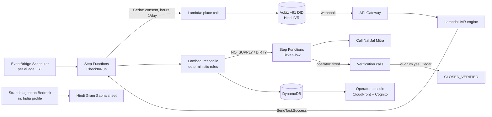

# JalSakshi · जल साक्षी

**Water witness. Households confirm whether tap water actually came, and repairs count only when they confirm it's back.**

> Built for **Environmental Hacks** (WeMakeDevs × AWS Builder Center, Bharat Builds Tour), **Heat & Water** track.
> Demo video: _coming soon_ · Live console: _coming soon_

---

## The problem

India's Jal Jeevan Mission has put a tap connection in most rural homes. Whether **water comes out of that tap** is a different question.

- On 30 Sep 2026, Chhattisgarh's Jal Jeevan Mission (JJM) Mission Director told every Collector to hand completed water schemes over to Gram Panchayats ("Jal Arpan") at the special Gram Sabhas from **2 Oct 2026**.
- The official progress report (JJM IMIS, data as on 07/10/2026) shows **7,603 Chhattisgarh villages reported "Har Ghar Jal" (tap water in every home) but only 6,594 certified**. About 1,009 villages are waiting on a Gram Sabha decision.
- A CAG audit tabled in July 2026 found villages certified **despite incomplete works**. In Korba, ₹516 crore has been paid and about 110 villages get water.
- The official review, *Jal Seva Aankalan*, is a once-a-cycle self-assessment by the village water committee. **Nobody asks each household whether water came today.**

The people who know are the women who wait at the tap, usually on a shared keypad phone, in Hindi or Chhattisgarhi.

## What JalSakshi does

1. **Asks.** A short Hindi phone call (works on any keypad phone): *Aaj nal mein paani aaya? Kitne ghante? Saaf tha?* ("Did tap water come today? For how many hours? Was it clean?")
2. **Decides, deterministically.** A tested rule engine (no AI) turns household answers into the village's day status: `SUPPLIED`, `PARTIAL`, `NO_SUPPLY`, `DIRTY`, or `UNVERIFIED` when too few households answered.
3. **Acts.** `NO_SUPPLY` or `DIRTY` opens a repair ticket and calls the village **Nal Jal Mitra** (pump operator) in Hindi.
4. **Verifies.** When the operator says "fixed", JalSakshi **calls the same households back**. The ticket closes as `CLOSED_VERIFIED` only when they confirm water. Otherwise it reopens, and escalates after 48 hours.
5. **Gives evidence.** It produces a Hindi evidence sheet for the **Gram Sabha**: observed reliability against the village's claimed Har Ghar Jal status, with every number sourced.

**Who it serves:** the household that needs water (the beneficiary), and the sarpanch, Panchayat Secretary and pump operator who must act (the operators).
**What changes:** a Gram Sabha certifies, or sends back a defect list, based on evidence from its own households, and a broken pump is fixed and *proven* fixed.

## Architecture



| Layer | AWS |
|---|---|
| Orchestration | Step Functions (Map, `waitForTaskToken`, Retry/Catch), EventBridge Scheduler |
| Compute | Lambda (Python 3.12, Powertools), API Gateway HTTP API |
| Data | DynamoDB (single table, PITR), S3 (prompt audio, daily data-source cache) |
| AI | Amazon Bedrock (Claude Haiku 4.5 via the **India** cross-region profile, so inference stays in Mumbai and Hyderabad; Nova 2 Lite fallback), **Strands Agents** (open source) |
| Policy | **Cedar** (open source): consent, calling hours, quorum-before-close, department privacy |
| Web | CloudFront + S3, Cognito |
| Ops | CloudWatch dashboard and alarms, AWS CDK (Python), region `ap-south-1` |

Voice: Vobiz Indian DID with our own Lambda serving the call flow. Hindi prompts are voiced by Sarvam Bulbul. Details are in [docs/ARCHITECTURE.md](docs/ARCHITECTURE.md).

## Data sources and freshness

| Source | Used for | Freshness |
|---|---|---|
| JJM IMIS Har Ghar Jal report | claimed and certified status | state self-reported, "as on" date shown |
| India-WRIS / CGWB 2025 | groundwater stage of the block | annual assessment |
| Open-Meteo | recent rain (context) | model, not gauge |
| Household check-ins | observed supply | live |

## Honest limits

- **Demo roles are played by our team** (villagers, pump operator), and this is labelled in the video. Calls go only to consenting test numbers.
- **PHED escalation is simulated.** There is no public API into IMIS, Meri Panchayat or PHED ticketing, so we never auto-dial government helplines.
- Production calling needs a service-series number and DLT registration through a panchayat or government partner.
- The MVP is Hindi only; keypad-first design keeps it usable for Chhattisgarhi speakers.

## Run it

Prerequisites: Python 3.12 + [uv](https://docs.astral.sh/uv/), Node 20.19+ + pnpm 9, an AWS CLI profile for an account with Bedrock access in `ap-south-1`. CDK runs through `npx aws-cdk@2`.

**Locally, no AWS needed** (tests stub every AWS and network call):

```bash
uv sync --all-groups
uv run ruff check . && uv run pytest -q
cd web && pnpm install && pnpm test && pnpm dev:mock   # console on seeded demo data, labelled simulated
```

**Your own stage** (`dev-<you>`, always `ap-south-1`):

```bash
cp .env.example .env                                  # local keys + TEST_NUMBERS (gitignored, never commit)
uv run python scripts/build_lambda.py                 # Lambda asset with Linux wheels -> build/lambda (do this first)
cd infra
npx aws-cdk@2 bootstrap aws://<account-id>/ap-south-1 # once per account
npx aws-cdk@2 deploy --all -c stage=dev-<you>         # voice_provider=simulator by default
cd ..
uv run python scripts/seed_demo.py --stage dev-<you> --allowlist --ivr-token --schedules
uv run python prompts/render.py --stage dev-<you>      # Hindi prompt audio (Sarvam Bulbul) -> S3 + CloudFront
```

Then:
- Put the vendor secrets in SSM as SecureString under `/jalsakshi/dev-<you>/`: `sarvam_api_key`, `vobiz_auth_id`, `vobiz_auth_token`, `vobiz_did`.
- Enable Bedrock model access in `ap-south-1` for Claude Haiku 4.5 (`in.` profile) and Nova 2 Lite (`global.` profile). Without it the brief falls back to its template.
- Console against the stage: copy `web/.env.example` to `web/.env.local`, fill it from the stack outputs (`ApiUrl`, `CognitoDomain`, `UserPoolClientId`, `WebUrl`/auth/callback), run `pnpm build`, and deploy `JalSakshi-dev-<you>-Web` again. Add users to a role group (`PANCHAYAT_SECRETARY`, `NAL_JAL_MITRA`, ...).
- Real phone calls: once the Vobiz DID is live, redeploy with `-c voice_provider=vobiz`. Only numbers on the stage's consent allowlist are ever dialled, and only 09:00–21:00 IST.

## Repository layout

```
src/jalsakshi/   core · policy · store · voice · agent · data · handlers
infra/           AWS CDK app
web/             operator console
prompts/         Hindi prompt catalog + renderer
tests/           unit + property tests
docs/            architecture, handover, demo script, research
```

## Team

- **Galaba Vamsi** ([@Galabavamsi](https://github.com/Galabavamsi)): voice, agent, data
- **Varun** ([@VARUN3WARE](https://github.com/VARUN3WARE)): core, infra, console

## AI tools used

Built with **Claude Code** (Anthropic) for research, planning and implementation, as the hackathon rules require us to disclose. In the product itself, Claude Haiku 4.5 on Amazon Bedrock is used only to extract spoken notes and write the Hindi evidence sheet; every decision is made by deterministic code.

## License

MIT
